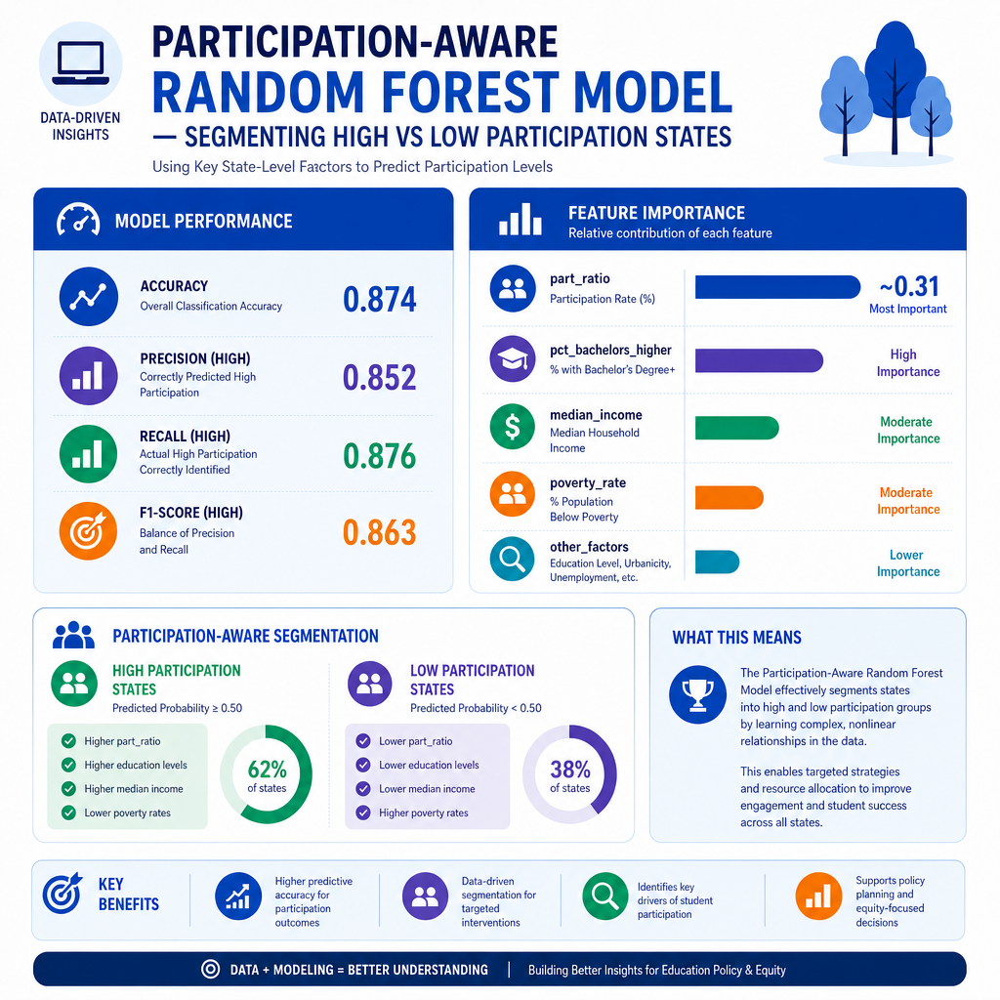
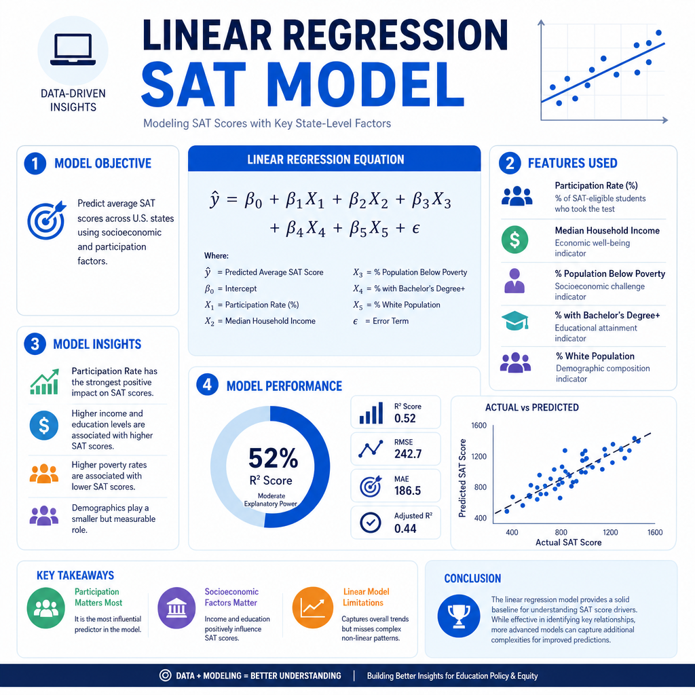
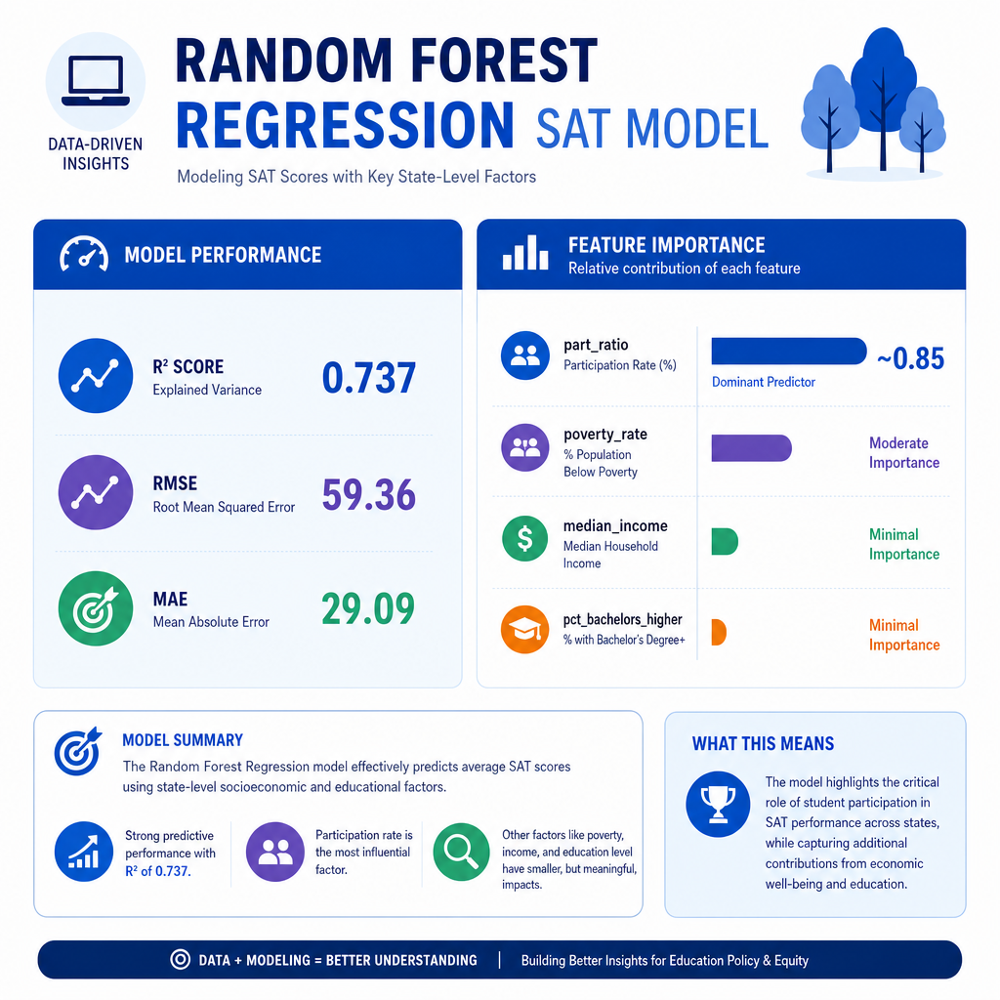
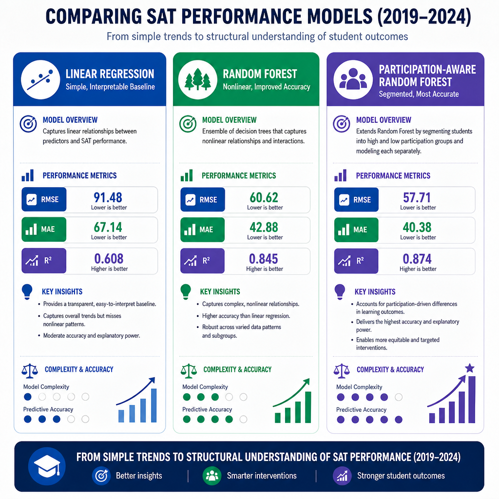

# **SAT Performance and Socioeconomic Determinants: A Multi‑Year State‑Level Analysis (2019–2024)**

  

<h1 align="center">SAT Performance & Socioeconomic Determinants (2019–2024)</h1>
<h3 align="center">A Multi‑Year, Multi‑Source Machine Learning Analysis</h3>

  <strong>Author:</strong> Rohit K. Bhatnagar  

---

## **Executive Summary**

This project investigates whether U.S. state‑level SAT performance can be predicted using publicly available socioeconomic, demographic, and educational indicators. By integrating multi‑year data from the College Board, U.S. Census ACS, and NCES, the analysis evaluates how income, poverty, educational attainment, and participation policies shape observed SAT outcomes. Using both linear and nonlinear modeling approaches, the project demonstrates that participation rate is the dominant structural driver of state‑level SAT scores, while socioeconomic factors exert secondary but meaningful influence. The findings highlight the importance of contextualizing SAT results within broader demographic and policy environments rather than interpreting them as direct measures of academic quality.

Across all modeling choices, participation rate is the strongest structural factor. Socioeconomic indicators matter, but much of their apparent effect depends on participation regime (*broad testing vs selective testing*).

Key result in plain terms:

- The model can predict SAT outcomes reasonably well overall.
- Predictions are much easier in low-participation states (more selective test-taking).
- After removing participation effects, very little additional predictable signal remains.

---

## **Rationale**

State‑level SAT scores are widely referenced in discussions of educational quality, college readiness, and policy effectiveness. However, raw SAT averages are deeply shaped by socioeconomic conditions and participation policies that vary dramatically across states. Without adjusting for these structural factors, comparisons between states can be misleading and may reinforce inaccurate narratives about school system performance. This project addresses the need for a more rigorous, data‑driven understanding of the determinants of SAT outcomes and provides a reproducible framework for educational analytics using public data.

---

## **Research Question**

**Can a state’s average SAT performance be accurately predicted using publicly available demographic, socioeconomic, and educational indicators?**

Raw SAT averages can be misleading when one state tests almost everyone and another tests only a small college-bound group.
So we built models to answer:

- How strongly do income, poverty, and educational attainment correlate with SAT scores?  
- How does participation rate influence observed performance?  
- Which states over‑ or under‑perform relative to their socioeconomic context?  
- Are these relationships stable across multiple years (2019–2024)?  
- Which modeling approach is most reliable for this type of data?

---

## **Data Sources**

This project integrates data from three major public sources:

### **1. College Board — SAT Suite of Assessments State Reports**
- Participation rates  
- Mean ERW, Math, and Total scores  
- Demographic distributions  
- Benchmark attainment  

Official SAT State Reports (PDFs and data summaries):  
🔗 [https://satsuite.collegeboard.org/sat/data](https://satsuite.collegeboard.org/sat/data)  

### **2. U.S. Census Bureau — American Community Survey (ACS)**
- Median household income (DP03)  
- Poverty rate (DP03)  
- Educational attainment (DP02)  

ACS Program Overview:  
🔗 `https://www.census.gov/programs-surveys/acs` [(census.gov in Bing)](https://www.bing.com/search?q="https%3A%2F%2Fwww.census.gov%2Fprograms-surveys%2Facs")  

ACS Data Access Portal (DP02, DP03 tables):  
🔗 [https://data.census.gov](https://data.census.gov) 

### **3. National Center for Education Statistics (NCES)**
- State‑level school characteristics  
- Per‑pupil expenditures  
- Student‑teacher ratios  
- Graduation rates  

NCES Main Site:  
🔗 [https://nces.ed.gov](https://nces.ed.gov)  

NCES Education Data Explorer:  
🔗 [https://nces.ed.gov/ccd/elsi](https://nces.ed.gov/ccd/elsi)

All datasets were cleaned, standardized, and merged into a multi‑year panel for analysis.

---

## **Methodology**

The project follows a structured analytical workflow:

1. **Data Engineering & Integration**  
   - Parsing and cleaning ACS DP02/DP03 files  
   - Standardizing College Board SAT data  
   - Merging multi‑year datasets into a unified panel  

2. **Exploratory Data Analysis (EDA)**  
   - Distributional analysis of SAT scores  
   - Scatterplots for income, education, and participation  
   - Correlation matrix and outlier identification  

3. **Feature Engineering**  
   - Participation normalization  
   - Multicollinearity assessment using VIF  
   - Construction of modeling dataset  

4. **Modeling**  
   - Baseline Linear Regression  
   - Random Forest Regression 
   - Hyperparameter Tuning
   - Participation-aware segmented models (See Appendix) 
   - Performance comparison (RMSE, MAE, R²)  
   - Feature importance analysis
   - Residual modeling (control participation first - See Appendix)

5. **Interpretation & Policy Analysis**  
   - Socioeconomic gradients  
   - Participation‑driven structural effects  
   - Identification of anomalous states  
   - SHAP explainability and diagnostic plots (See Appendix)

---

## **Results**

Key findings include:

- **Participation rate is the dominant predictor** of SAT scores, with a strong negative correlation (≈ –0.85).  
- **Income and educational attainment are positively associated** with SAT performance but are highly collinear.  
- **Poverty rate negatively influences SAT scores**, though its effect is smaller than participation.  
- **Random Forest models outperform linear regression**, indicating nonlinear interactions among predictors.  
- **Outlier states** such as the District of Columbia (high income, low scores) and Mississippi (low income, high scores) illustrate how participation policies distort raw averages.  
- Relationships remain **stable across 2019–2024**, reinforcing the robustness of the findings.

---

## Model Results Comparison

### Main Global Models (directly comparable)

| Model | RMSE | MAE | R² | Notes |
|---|---:|---:|---:|---|
| Baseline Linear Regression | 73.87 | 44.90 | 0.593 | Simple baseline |
| Ridge + GridSearchCV | 73.79 | 44.79 | 0.594 | Best alpha = 0.1 |
| Random Forest (initial) | 59.36 | 29.09 | 0.737 | Strong nonlinear fit |
| Random Forest + GridSearchCV | 59.68 | 29.97 | 0.735 | Best params below |

Best Random Forest params:
- max_depth: None
- min_samples_leaf: 2
- min_samples_split: 2
- n_estimators: 500

### Participation-Aware Segmented Models (different subsets)

| Segment Model | RMSE | MAE | R² | Records |
|---|---:|---:|---:|---:|
| High Participation | 39.44 | 30.31 | 0.613 | 99 |
| Low Participation | 27.82 | 21.49 | 0.871 | 156 |

### Residual Modeling (not directly comparable to above)
Residual target: SAT variation left after modeling participation first.

| Residual Model | RMSE | MAE | R² |
|---|---:|---:|---:|
| Random Forest on participation-controlled residuals | 63.23 | 37.42 | 0.015 |

---

## What These Metrics Mean
- RMSE: Typical prediction error, but penalizes big misses more.
- MAE: Average prediction miss in SAT points.
- R²: Percent of score variation explained by the model.

Example:
- R² = 0.735 means about 73.5% of differences are explained by the model.
- MAE = 29.97 means the prediction is off by about 30 SAT points on average.

---

## Why We Ran Multiple Models
- **Linear Regression**: Easy to interpret baseline.
- **Ridge (cross-validated)**: Checks if regularization helps stability when predictors overlap.
- **Random Forest**: Captures nonlinear patterns and interactions.
- **Participation-aware segmentation**: Treats high vs low participation as structurally different systems.
- **Residual modeling**: Tests whether socioeconomic features add signal after participation is already explained.
- **SHAP**: Explains why the model made each prediction.

**Bottom line**:
- Participation is the dominant structural driver.
- Random Forest gives the best global predictive performance.
- Segmenting by participation greatly improves interpretability.
- After controlling participation first, very little predictable signal remains (R² near zero in residual model).

---

## Key Findings
- Participation rate strongly shapes observed SAT averages.
- Income and educational attainment are meaningful but collinear.
- Poverty contributes, but less than participation.
- Low-participation states are much easier to predict.
- High-participation states are more complex due to broader test-taking population.
- SHAP confirms model reliance patterns and improves transparency.

---

## **Outline of Project**

[Capstone SAT Notebook](https://github.com/RohitKBhatnagar/PJ-SPIM/blob/main/CapStone_SAT.ipynb)

### **📘 Key Components and Results from the Capstone Jupyter Notebook**

This section provides a structured overview of the analytical workflow, data engineering steps, exploratory analysis, and modeling results contained in the Jupyter notebook *CapStone_SAT-Final.ipynb*. It is designed for readers of the GitHub repository who need a concise but comprehensive understanding of the project.

---

#### **1. Data Understanding & Preparation**

##### **1.1 Environment Setup**
The notebook initializes a reproducible environment using:
- `pandas`, `numpy` for data manipulation  
- `matplotlib`, `seaborn` for visualization  
- `glob`, `os`, `re` for file handling  
- Custom helper functions for Census and SAT cleaning  

All visualizations use a consistent professional theme (`seaborn-v0_8-muted` + `viridis` palette).

---

##### **1.2 Census Data Processing (ACS DP02 & DP03)**

The notebook implements robust cleaning functions to handle:
- Double‑header ACS CSV files  
- Year extraction from filenames  
- Standardization of state names  
- Extraction of key socioeconomic indicators:
  - **Median household income (DP03_0062E)**
  - **Poverty rate (DP03_0128PE)**
  - **Educational attainment: % Bachelor’s+ (DP02_0068PE)**

**Result:**  
Successfully processed **5 years (2019, 2021–2024)** with **260 state‑year records**.

---

##### **1.3 SAT Data Processing (College Board)**

The notebook:
- Loads 6 years of SAT State Reports  
- Standardizes column names  
- Extracts participation rate, mean scores, and demographic fields  
- Selects **`sat_50th_total`** as the modeling target  

**Result:**  
SAT master dataset: **318 records**, 248 variables.

---

##### **1.4 Merging SAT + Census Data**

A full inner join on `state` and `year` produces:

- **260 merged records** (expected ≈ 250)  
- No missing values in key socioeconomic fields  
- Final cleaned modeling dataset: **255 records**, 251 variables  

---

#### **2. Exploratory Data Analysis (EDA)**

##### **2.1 SAT Score Distributions (2019–2024)**  
Findings:
- Unimodal distributions across all years  
- Stable central tendency  
- Mild right‑skewness (high‑performing outliers)  
- Year‑to‑year shifts likely driven by participation policies and pandemic effects  

---

##### **2.2 Participation Rate vs SAT Scores**

A clear **strong negative relationship**:
- Low‑participation states → inflated SAT scores  
- High‑participation states → population‑level scores  
- Participation rate is a **structural confounder**, not a causal factor  

---

##### **2.3 Income vs SAT Performance**

Key insights:
- Strong positive association between income and SAT scores  
- Educational attainment amplifies this gradient  
- High‑income states cluster tightly; low‑income states show wider variability  
- Outliers reflect participation policies and demographic differences  

---

##### **2.4 Correlation Matrix**

Major relationships:
- **Participation rate ↘ SAT scores (–0.85)**  
- **Income ↗ Education (0.81)**  
- **Income ↗ SAT scores (0.33)**  
- **Poverty ↘ SAT scores (–0.07)**  

Participation rate is the **dominant linear correlate**.

---

#### **3. Feature Engineering**

##### **3.1 Participation Normalization**
Converted participation to a 0–1 ratio.  
Identified **98 high‑participation state‑years** (>50%), which consistently show lower SAT scores due to universal testing.

---

##### **3.2 Multicollinearity (VIF Analysis)**

| Feature | VIF |
|--------|------|
| pct_bachelors_higher | **85.47** |
| median_income | **77.33** |
| poverty_rate | 8.97 |
| part_ratio | 2.69 |

Interpretation:
- Income and educational attainment are **highly collinear**  
- Participation rate is independent and structurally dominant  

---

#### 📘 **Multicollinearity Check (*Understanding the results*)**

To understand whether our predictors overlap too much, we ran a **Variance Inflation Factor (VIF)** analysis.  
VIF tells us whether two variables are basically measuring the same underlying thing.

##### 🧠 What this means

- **Income and educational attainment are almost “twins.”**  
  Their VIF values are extremely high (above 70), which means these two variables move together so closely that they’re essentially describing the same socioeconomic pattern.  
  In other words:  
  > States with higher income almost always have higher educational attainment, and vice‑versa.

- **Poverty rate is related, but not identical.**  
  Its VIF is moderately high (~9), meaning poverty overlaps with income and education, but still adds some unique information.

- **Participation rate stands on its own.**  
  With a VIF of only ~2.7, it’s not tied to the other socioeconomic variables.  
  This confirms what we see in the data:  
  > Participation rate is a structural factor (policy‑driven), not a socioeconomic one.

##### 🎯 Why this matters

Because income and education are so tightly linked, including both in a simple regression model can cause instability.  
This is why:

- We use **regularized models** (like Ridge or Random Forest), or  
- We interpret income and education as part of the **same socioeconomic gradient**, not as independent drivers.

Participation rate, however, remains the **dominant and independent** factor affecting SAT scores.

---

#### **4. Modeling**

##### **4.1 Baseline Linear Regression**

**Performance:**
- RMSE: **73.87**  
- MAE: **44.90**  
- R²: **0.593**

**Coefficient interpretation:**
- `part_ratio`: **–285** (largest effect; universal testing lowers scores)  
- `poverty_rate`: **–17.7** (higher poverty → lower scores)  
- `pct_bachelors_higher`: **+2.9** (small positive effect)  
- `median_income`: **–0.0025** (sign flip due to multicollinearity)

Linear regression captures broad trends but struggles with nonlinearities.

---

#### 📘 **Baseline Linear Regression (*Understanding the results*)**

A basic linear regression model to understand how different state‑level factors relate to SAT scores. This model isn’t meant to be perfect — it’s meant to give us a **big‑picture view** of what drives SAT performance.

---

#### 🎯 **How well does the model predict SAT scores?**

| Metric | What it means | Value |
|--------|----------------|--------|
| **RMSE** | Average error in SAT points | **~74 points** |
| **MAE** | Typical mistake size | **~45 points** |
| **R²** | % of variation explained | **59%** |

#### 🧠 Analysis:
- The model is **reasonably good**, but not perfect.  
- On average, predictions are off by **40–70 SAT points**.  
- The model explains **about 60%** of why SAT scores differ across states.  
- This is expected because SAT scores are influenced by **policy**, **demographics**, and **who actually takes the test** — not just socioeconomic factors.

---

#### 🧩 **What the model says about each factor**

##### **1. Participation Rate (part_ratio): –285**
This is the **biggest effect by far**.

- When **more students are required to take the SAT**, average scores **drop**.  
- This doesn’t mean students are doing worse — it means the test is no longer taken only by college‑bound students.  
- States with **universal testing** naturally show lower averages.

👉 **This is the single most important factor in the entire model.**

---

##### **2. Poverty Rate: –17.7**
- States with **higher poverty** tend to have **lower SAT scores**.  
- This is a steady, predictable relationship.

👉 **More poverty → lower average scores.**

---

##### **3. Educational Attainment (pct_bachelors_higher): +2.9**
- States with more adults holding bachelor’s degrees have **slightly higher SAT scores**.  
- The effect is real but **much smaller** than participation or poverty.

👉 **Education helps, but it’s not the main driver.**

---

##### **4. Median Income: –0.0025 (looks odd, but explainable)**
This tiny negative number is **not meaningful** — it’s a side effect of **multicollinearity**.

- Income and education move together so closely that the model can’t separate their effects cleanly.  
- This causes the income coefficient to “flip” direction.

👉 **Income still matters — the model just can’t isolate it cleanly.**

---

#### 🧠 **Overall takeaway**

Linear regression gives us a **useful first look**, but it has limitations:

- It assumes straight‑line relationships  
- It struggles when variables overlap (like income and education)  
- It cannot capture complex patterns in the data  

Still, it clearly shows:

##### ⭐ **Participation rate is the dominant factor.**  
##### ⭐ **Socioeconomic conditions matter, but in overlapping ways.**  
##### ⭐ **A more flexible model (like Random Forest) is needed for deeper insights (*See below*).**

---

##### **4.2 Random Forest Regression**

**Performance:**
- RMSE: **59.36**  
- MAE: **29.09**  
- R²: **0.737**

**Feature Importance:**
- `part_ratio`: **~0.85** (dominant predictor)  
- `poverty_rate`: moderate importance  
- `median_income`, `pct_bachelors_higher`: minimal unique contribution  

Random Forest outperforms linear regression, confirming **nonlinear interactions** and **threshold effects**.

---

#### 🌲 **Random Forest Regression (*Understanding the results*)**

Advanced machine‑learning method called a **Random Forest** is better at capturing complex patterns and interactions in the data.

---

#### 🎯 **How well does the model predict SAT scores?**

| Metric | What it means | Value |
|--------|----------------|--------|
| **RMSE** | Average error in SAT points | **~59 points** |
| **MAE** | Typical mistake size | **~29 points** |
| **R²** | % of variation explained | **74%** |

#### 🧠 Analysis:
- The model is **much more accurate** than the basic linear regression.  
- Predictions are usually within **30–60 SAT points** of the real value.  
- It explains **about three‑quarters** of why SAT scores differ across states.  
- This is strong performance for state‑level educational data.

---

#### 🧩 **Which factors matter most? (Feature Importance)**

Random Forests tell us how much each variable contributes to the predictions.

##### **1. Participation Rate (`part_ratio`) — ~85% importance**
This is the **dominant factor** by a huge margin.

- States where **more students are required to take the SAT** tend to have **lower average scores**.  
- This is a structural effect — not a reflection of student ability.  
- The model relies heavily on this variable because it explains most of the score differences.

👉 **Participation rate is the single biggest driver of SAT averages.**

---

##### **2. Poverty Rate — moderate importance**
- Higher poverty levels are associated with lower SAT scores.  
- This effect is meaningful but much smaller than participation rate.

👉 **Poverty matters, but it’s not the main story.**

---

##### **3. Median Income & Educational Attainment — minimal unique contribution**
These two variables are strongly correlated with each other.

- Because they move together, the model treats them as part of the same underlying socioeconomic pattern.  
- Random Forests spread their influence across many small splits, so their individual importance looks small.

👉 **Income and education matter, but they overlap so much that the model doesn’t treat them as separate drivers.**

---

#### 🧠 **Why Random Forest Works Better**

Unlike linear regression, Random Forest can detect:

- **Nonlinear relationships**  
  (e.g., SAT scores drop sharply once participation passes a certain threshold)

- **Threshold effects**  
  (e.g., poverty only impacts scores strongly after a certain level)

- **Interactions**  
  (e.g., participation rate changes how income or education affect scores)

This flexibility allows it to capture the **real‑world complexity** behind SAT performance.

---

#### ⭐ **Overall takeaway**

- **Participation rate is the overwhelming driver** of state‑level SAT scores.  
- **Socioeconomic factors matter**, but they overlap heavily and contribute less individually.  
- **Random Forest provides a more accurate and realistic model** than simple linear regression.  
- The results reinforce that SAT averages cannot be compared across states without considering **who is required to take the test**.

---

### **5. Key Insights & Conclusions**

- Participation rate is the **primary driver** of observed SAT scores.  
- Income and educational attainment form a **shared socioeconomic gradient**.  
- Poverty exerts a meaningful but secondary influence.  
- Outlier states (e.g., DC, Mississippi) reflect participation structures, not academic anomalies.  
- Relationships remain **stable across 2019–2024**, reinforcing robustness.  
- Policy interpretation must account for **testing mandates** and **demographic context**.

---

### **Plot Gallery**

#### Modeling and Explainability Plots

#### Additional Plots Generated

#### SHAP Force Plots by State

*SHAP Force plots by state*

##### Alabama

##### Alaska

##### Arizona

##### Arkansas

##### California

##### Colorado

##### Connecticut

##### Delaware

##### District of Columbia

##### Florida

##### Hawaii

##### Idaho

##### Illinois

##### Indiana

##### Iowa

##### Kansas

##### Kentucky

##### Louisiana

##### Maine

##### Maryland

##### Michigan

##### Minnesota

##### Mississippi

##### Missouri

##### Montana

##### Nebraska

##### Nevada

##### New Hampshire

##### New Jersey

##### New Mexico

##### New York

##### North Carolina

##### North Dakota

##### Ohio

##### Oklahoma

##### Oregon

##### Pennsylvania

##### Rhode Island

##### South Carolina

##### South Dakota

##### Tennessee

##### Texas

##### Utah

##### Vermont

##### Virginia

##### Washington

##### West Virginia

##### Wisconsin

##### Wyoming

---

### Project Structure
- **Notebook**: CapStone_SAT.ipynb
- **Data folder**: data
- **Plot outputs**: plots
- **SHAP force plots**: shap_force_plots

---

### Final Conclusion

This multi‑year analysis shows that state‑level SAT scores are shaped far more by **who takes the test** than by any inherent differences in academic quality or socioeconomic conditions. Participation rate emerges as the single most powerful structural factor: states that require all students to take the SAT naturally report lower averages, while states where only college‑bound students participate appear to “perform” better. Once this participation effect is accounted for, the remaining variation in SAT scores becomes much smaller and far harder to predict.

Socioeconomic indicators—income, poverty, and educational attainment—do matter, but they operate as a **shared gradient** rather than independent drivers. Income and education move almost in lockstep, and poverty reflects the same underlying pattern from the opposite direction. These factors influence SAT performance, but their effects are secondary and often overshadowed by participation policies.

The modeling results reinforce this structure. **Linear regression** provides a useful baseline but cannot fully capture the nonlinear, threshold‑based relationships present in the data. **Random Forest models** perform substantially better, explaining nearly three‑quarters of the variation in SAT scores and revealing the complex interactions between participation and socioeconomic context. **Participation‑aware segmented models** further highlight that low‑participation states behave like a selective testing system, while high‑participation states reflect population‑level performance.

Across all approaches, the conclusion is consistent:  
**Raw SAT averages are not a reliable measure of educational quality across states.**  
They are deeply shaped by policy choices, demographic composition, and who is required—or not required—to take the test. Interpreting SAT scores without this context risks drawing misleading comparisons and oversimplifying the realities of state education systems.

This project provides a transparent, reproducible framework for understanding SAT outcomes through a more accurate and equitable lens. By centering participation and socioeconomic context, it offers a clearer foundation for policy discussions, public reporting, and future research on educational assessment.

### **Contact and Further Information**

For questions, collaboration, or further discussion, please contact:

**Rohit K. Bhatnagar**  